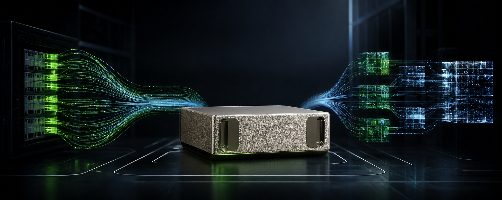
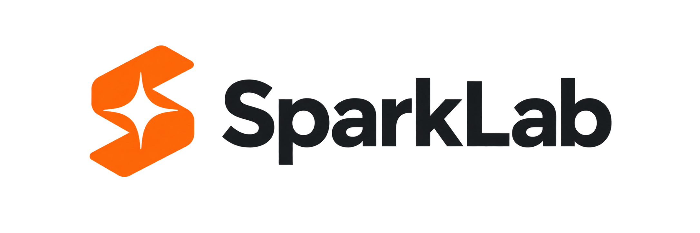

<p align="center">
  
</p>

<p align="center"><strong>Built for NVIDIA DGX Spark (GB10)</strong></p>

<p align="center">
  
</p>

<p align="center">
  <a href="#documentation">
    
  </a>
  <a href="https://github.com/sixteen-miles-labs/sparklab/releases">
    
  </a>
  <a href="LICENSE">
    
  </a>
</p>

<p align="center">
  <a href="https://x.com/oakmindai">
    
  </a>
  <a href="https://huggingface.co/oakmindai">
    
  </a>
</p>

<h3 align="center">Run frontier open-weight models privately on NVIDIA DGX Spark.</h3>

<p align="center">
  SparkLab is developed by <strong><a href="https://github.com/sixteen-miles-labs">SixteenMiles Labs</a></strong>,
  a research lab under <strong><a href="https://oakmind.ai/">Oakmind AI</a></strong>.
</p>

SparkLab is a GB10-native inference product for local, single-system deployments. It
combines immutable model recipes, unified-memory admission, resumable checkpoint
acquisition, FTW preparation, NVMe-backed MoE execution, and OpenAI- and
Anthropic-compatible APIs.

## Supported production target

SparkLab deliberately supports one narrow hardware profile:

- NVIDIA GB10 Grace Blackwell Superchip (`SM121`)
- 128 GB coherent unified memory
- ARM64 Linux or DGX OS
- Python 3.10 or newer
- NVIDIA driver r580 or newer and CUDA 13 toolkit
- Local NVMe storage for checkpoints, FTW artifacts, and disk-backed experts
- One local DGX Spark; multi-node and high-concurrency serving are outside the Beta scope

Recipe launch fails closed on failed platform, memory, swap, dependency, and storage
checks. Storage whose NVMe backing cannot be established produces a warning requiring
review; `sparklab doctor --strict` also returns non-zero for warnings. Unsupported hardware
may still work through native runtime fallbacks, but it is not a SparkLab support claim.

## Why SparkLab

- **GB10 admission:** `sparklab doctor` validates architecture, CUDA, unified memory,
  swap, dependencies, NVMe backing, and free capacity with human and JSON output.
- **Immutable recipes:** acquisition pins model revisions, records manifests, validates
  prepared artifacts, and rejects mismatched provenance.
- **Unified-memory planning:** runtime admission budgets weights, expert cache, KV and
  recurrent state, workspaces, and an operating-system reserve without counting swap as
  capacity.
- **Frontier models beyond memory:** FTW expert banks and bounded NVMe-backed caching let
  selected MoE checkpoints exceed physical memory.
- **Stable local APIs:** OpenAI Chat Completions, Responses, and Anthropic Messages share
  one loopback endpoint with streaming, reasoning, and tool-call support.
- **Evidence-bound claims:** model status and performance point to versioned,
  complete-checkpoint GB10 records rather than inferred capability.

## Model portfolio

<table>
  <thead>
    <tr>
      <th>Model</th>
      <th>Parameters</th>
      <th>Quantization</th>
      <th>Status</th>
      <th align="right">tok/s</th>
      <th align="right">Warm TTFT (s)</th>
      <th>Run</th>
    </tr>
  </thead>
  <tbody>
    <tr>
      <th colspan="7" align="left">Fast — routine chat, editing, and short agent loops</th>
    </tr>
    <tr>
      <td><a href="https://huggingface.co/nvidia/Qwen3.6-35B-A3B-NVFP4">Qwen3.6-35B-A3B</a></td>
      <td>35B total / 3B active</td>
      <td>NVFP4 · Marlin + MTP4 container</td>
      <td>Preview</td>
      <td align="right">112.08</td>
      <td align="right">1.436</td>
      <td><a href="docs/models/qwen3.6-35b-a3b.md">Instructions</a></td>
    </tr>
    <tr>
      <td><a href="https://huggingface.co/RadixArk/Qwen3.8-27B-NVFP4">Qwen3.8-27B</a></td>
      <td>27B dense</td>
      <td>NVFP4 · FP4 prefill + DFlash2-12 (greedy)</td>
      <td>Experimental</td>
      <td align="right">49.52</td>
      <td align="right">0.125</td>
      <td><a href="docs/models/qwen3.8-27b.md">Instructions</a></td>
    </tr>
    <tr>
      <th colspan="7" align="left">Frontier — quality-first coding, reasoning, and long agent work</th>
    </tr>
    <tr>
      <td><a href="https://huggingface.co/oakmindai/Qwen3.8-Flash-Next-NVFP4-FTW">Qwen3.8-Flash-Next</a></td>
      <td>125B LM + 55B auxiliary / 6B active</td>
      <td>NVFP4 · FTW + opt-in fast MTP3</td>
      <td>Experimental</td>
      <td align="right">42.14</td>
      <td align="right">0.244</td>
      <td><a href="docs/models/qwen3.8-flash-next.md#experimental-full-vocabulary-draft-optimization">Instructions</a></td>
    </tr>
    <tr>
      <td><a href="https://huggingface.co/deepseek-ai/DeepSeek-V4-Flash-0731">DeepSeek V4 Flash</a></td>
      <td>284B total / 13B active</td>
      <td>DS-FP4 · FTW + optional DSpark5</td>
      <td>Preview</td>
      <td align="right">14.02</td>
      <td align="right">0.515</td>
      <td><a href="docs/models/deepseek-v4.md">Instructions</a></td>
    </tr>
    <tr>
      <td><a href="https://huggingface.co/oakmindai/GLM-5.3-Flash-NVFP4-FTW">GLM-5.3 Flash</a></td>
      <td>320B total / 18B active</td>
      <td>NVFP4 + KDA FP8 · FTW + optional MTP3</td>
      <td>Experimental</td>
      <td align="right">7.77</td>
      <td align="right">6.395</td>
      <td><a href="docs/models/glm-5.3-flash.md">Instructions</a></td>
    </tr>
    <tr>
      <th colspan="7" align="left">Research — bounded execution outside the interactive envelope</th>
    </tr>
    <tr>
      <td><a href="https://huggingface.co/oakmindai/DeepSeek-V4.1-Flash-FTW">DeepSeek V4.1 Flash</a></td>
      <td>552B total / 8–16B active</td>
      <td>MXFP4 / MXFP8 · disk streaming + optional DSpark5</td>
      <td>Experimental</td>
      <td align="right">1.05</td>
      <td align="right">76.329</td>
      <td><a href="docs/models/deepseek-v4.1-flash.md">Instructions</a></td>
    </tr>
    <tr>
      <td><a href="https://huggingface.co/oakmindai/GLM-5.3-NVFP4-FTW">GLM-5.3</a></td>
      <td>753B total / 40B active</td>
      <td>NVFP4 + resident FP8 · FTW + optional DFlash2-4</td>
      <td>Experimental</td>
      <td align="right">1.29</td>
      <td align="right">2.085</td>
      <td><a href="docs/models/glm-5.3.md">Instructions</a></td>
    </tr>
    <tr>
      <td><a href="https://huggingface.co/oakmindai/Kimi-K3-NVFP4-FTW">Kimi K3</a></td>
      <td>2.8T total / 16 of 896 experts</td>
      <td>ModelOpt NVFP4/FP8 · FTW</td>
      <td>Experimental</td>
      <td align="right">0.16</td>
      <td align="right">395.405</td>
      <td><a href="docs/models/kimi-k3.md">Instructions</a></td>
    </tr>
  </tbody>
</table>

Qwen3.6-35B-A3B, Qwen3.8-27B and Flash-Next support [experimental native image inputs](docs/models/qwen-vision.md)
through the source-only `--vision-model` option. The table reports their separate text profiles.

Status meanings:

- **Experimental:** implementation or measured evidence exists, but required gates remain
  incomplete or failed.
- **Preview:** a bounded supported path exists, but the full release promise is incomplete.
- **Certified:** the exact recipe, revision, artifact, and release environment passed all
  required correctness, parser, agent, context, latency, memory, NVMe, and endurance gates.

Run `sparklab models --json` for exact recipe versions, checkpoint revisions, artifact
fingerprints, implementation state, evidence IDs, and known constraints.

## Documentation

Start with installation, then follow the quick start or a model's run instructions.
The current Qwen3.8-Flash-Next recipe requires a
[source installation](docs/install.md#method-2-install-from-source); the released 0.1.2
wheel does not include its required runtime support.

- [Installation](docs/install.md)
- [Quick start](docs/quickstart.md)
- [Model catalog and runtime behavior](docs/models.md)
- [CLI reference](docs/cli.md)
- [GB10 benchmark evidence](benchmarks/gb10/README.md)

## Contribution

SparkLab is stewarded in public by SixteenMiles Labs. Oakmind AI provides organizational
backing, legal stewardship, and commercial support.

- [Contributing guide](CONTRIBUTING.md)
- [Governance](GOVERNANCE.md)
- [Release and package policy](RELEASING.md)
- [Security policy](SECURITY.md)
- [Code of conduct](CODE_OF_CONDUCT.md)

## Credits and citation

SparkLab incorporates source and research contributions from
[FreeToken](https://github.com/FlashML-org/FreeToken) and builds on open inference projects including
[mini-sglang](https://github.com/sgl-project/mini-sglang),
[SGLang](https://github.com/sgl-project/sglang),
[vLLM](https://github.com/vllm-project/vllm),
[FlashInfer](https://github.com/flashinfer-ai/flashinfer),
[flash-linear-attention](https://github.com/fla-org/flash-linear-attention),
[LightLLM](https://github.com/ModelTC/lightllm), and
[llama.cpp](https://github.com/ggml-org/llama.cpp).

If you use SparkLab, cite the software:

```bibtex
@software{sixteenmileslabs2026sparklab,
  title={SparkLab: Frontier Open-Weight Model Inference on NVIDIA DGX Spark},
  author={{SixteenMiles Labs}},
  year={2026},
  url={https://github.com/sixteen-miles-labs/sparklab},
  license={Apache-2.0}
}
```

For work that builds on SparkLab's FreeToken-derived execution techniques, also cite the
[FreeToken paper](https://arxiv.org/abs/2608.16157):

```bibtex
@article{yang2026freetoken,
  title={FreeToken: Efficient Edge-Native MoE Serving with Bandwidth-Adaptive Execution},
  author={Yang, Shuo and Fan, Xiaoze and Pan, Melissa and Xi, Haocheng and Wang, Zhe and Sun, Shanlin and Keutzer, Kurt and Han, Song and Zaharia, Matei and Xu, Chenfeng and Stoica, Ion},
  journal={arXiv preprint arXiv:2608.16157},
  year={2026}
}
```
